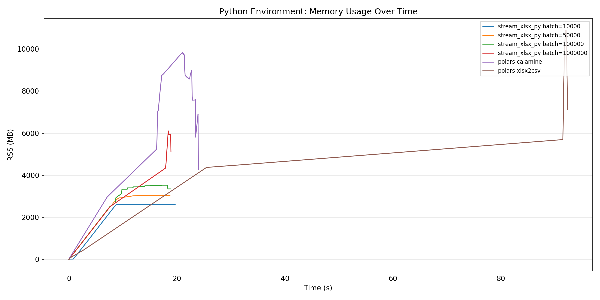
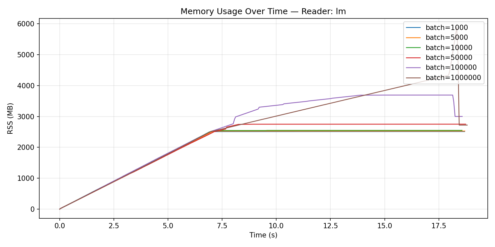
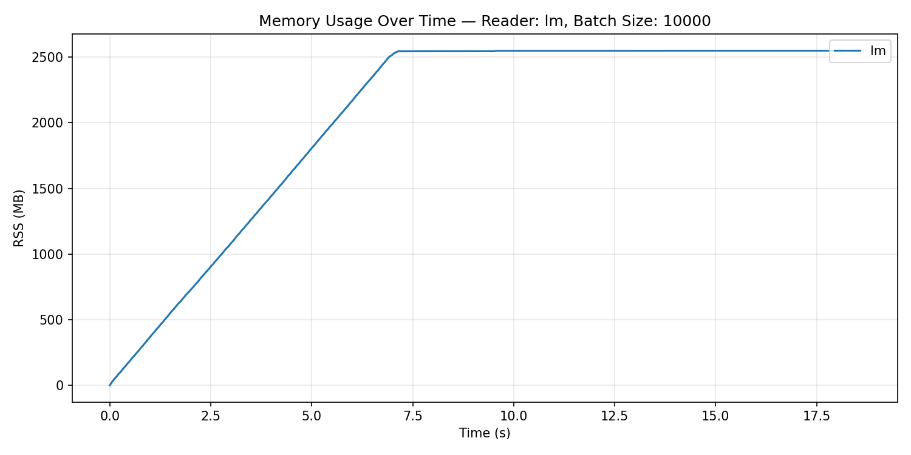
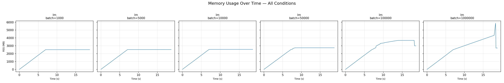

# stream_xlsx

流式 xlsx 读取器，支持 Rust 库、CLI 工具和 Python 绑定。基于 quick-xml + zip 实现真正的流式解析，**不一次性将整张表载入内存**。

## 项目结构

```
sxlsx/              # CLI 工具（cargo build）
stream_xlsx/        # 纯 Rust 库（rlib）
stream_xlsx_py/     # pyo3 Python 绑定（maturin build）
```

## 特点

- **流式读取**：逐 batch 产出 Polars DataFrame，100 万行 × 60 列（~660 MB）只需 ~19 秒
- **低内存**：峰值内存比 polars+calamine 降低 **~50–75%**
- **多 sheet 支持**：打开后可查看所有 sheet 名称，按需切换，共享字符串/styles 只解析一次
- **惰性加载**：`open()` 仅解析 sheet 列表；`sharedStrings.xml` / `styles.xml` 在首次读取时才加载
- **skip_rows**：支持跳过指定 0-based 行索引，不影响 header 解析
- **类型推断**：边读边推断列类型（Int → Float → String），空值不参与推断
- **日期支持**：读取 `xl/styles.xml` 的 `cellXfs` + 自定义 `numFmt`，自动识别日期列
- **Shell 补全**：内置 zsh / bash 自动补全生成

## 安装

### CLI

```bash
cargo build --release
# 二进制位于 target/release/sxlsx
```

### Python

```bash
cd stream_xlsx_py
maturin build --release
pip install target/wheels/stream_xlsx_py-*.whl
```

PyPI 安装（即将发布）：

```bash
pip install stream-xlsx-py
```

## 使用

### CLI

```bash
# 导出为 CSV
sxlsx tf csv data.xlsx --output out.csv

# 导出为 parquet
sxlsx tf parquet data.xlsx

# 指定 sheet（按名称或索引）
sxlsx tf csv data.xlsx --sheet-name "Sheet1"
sxlsx tf csv data.xlsx --sheet-idx 0

# 统计行数（性能基准）
sxlsx test count data.xlsx

# 生成测试文件：100 万行 × 60 列
sxlsx test test-file big.xlsx --rows 1000000 --col 60

# Shell 自动补全
sxlsx completion
```

### Python

```python
import stream_xlsx_py as sx

# 流式读取（默认 batch_size=10000）
reader = sx.read_xlsx("data.xlsx", batch_size=10000)
for df in reader:
    print(df.shape)

# 查看所有 sheet
print(reader.sheet_names())        # ["Sheet1", "Sheet2"]

# 切换 sheet
reader.select_sheet("Sheet2")
for df in reader:
    print(df.shape)

# 跳过指定行（0-based，不影响 header）
reader = sx.read_xlsx("data.xlsx", skip_rows=[1, 3, 5])
for df in reader:
    print(df.shape)
```

## Benchmark

测试文件：`test_100w_60c.xlsx`（100 万行 × 60 列，`sxlsx test test-file --rows 1000000 --col 60` 生成，约 659 MB）

测试环境：macOS, Apple Silicon, release 构建。内存采样间隔 50 ms。

### Python 环境对比

在 Python 进程中对比 `stream_xlsx_py` 流式遍历与 `polars.read_excel` 全量加载：

| 方案 | 时间 | 峰值内存 | 说明 |
|------|------|---------|------|
| **stream_xlsx_py (bs=10k)** | **19.71 s** | **2,621 MB** | 流式遍历，batch=10k |
| stream_xlsx_py (bs=1M) | 18.93 s | 6,110 MB | 全量加载（单 batch） |
| polars + calamine | 24.00 s | 9,848 MB | `pl.read_excel(engine="calamine")` |
| polars + xlsx2csv | 92.41 s | 10,902 MB | `pl.read_excel(engine="xlsx2csv")` |

**结论**：
- `stream_xlsx_py` 比 polars+calamine **快 18%**，内存 **低 73%**
- 流式场景（bs=10k）内存仅 2.6 GB，全量加载（bs=1M）时与 polars 接近但仍低 2.3 GB



上图可见 polars calamine 在 ~24 s 达到 ~9.8 GB 峰值，而 stream_xlsx_py 流式场景全程稳定在 ~2.6 GB，全量加载时约 6.1 GB。

### CLI 环境对比

逐 batch 遍历不保留中间结果（`sxlsx test count`）：

| batch_size | 时间 | 峰值内存 | 批次数 |
|-----------|------|---------|--------|
| 1,000 | 18.74 s | 2,512 MB | 1000 |
| 5,000 | 18.75 s | 2,527 MB | 200 |
| **10,000** | **18.62 s** | **2,549 MB** | **100** |
| 50,000 | 18.80 s | 2,751 MB | 20 |
| 100,000 | 18.64 s | 3,692 MB | 10 |
| 1,000,000 | 18.87 s | 5,879 MB | 1 |

**结论**：
- batch_size 对时间影响极小（~18.6–18.9 s），瓶颈在 XML 解析和 ZIP 解压
- 流式场景（bs≤10k）峰值内存稳定在 ~2.5 GB；bs=100k 时升至 ~3.7 GB；全量加载（bs=1M）约 ~5.9 GB







上图展示了 6 个 batch size 条件下的内存曲线。流式场景（bs≤100k）曲线呈线性增长后进入平稳期；全量加载（bs=1M，最右列）内存显著升高，因为最终需要容纳完整的 DataFrame。

### 为什么内存更低？

1. **惰性加载**：`open()` 仅解析 `workbook.xml`（~1 KB），`sharedStrings.xml`（~46 MB）和 `styles.xml`（~20 KB）在首次读取时才加载
2. **共享数据复用**：多 sheet 切换时，sharedStrings/styles 只解析一次，通过 `Arc` 共享
3. **流式 XML 解析**：`BufReader` 直接流式解析，无中间 `Vec<u8>` 缓冲
4. **紧凑字符串存储**：sharedStrings 使用 `Vec<Box<str>>`，每元素比 `Vec<String>` 省 24 bytes 容量开销

### 推荐配置

| 场景 | 推荐参数 |
|------|---------|
| 超大文件（>100 MB）| `batch_size=10000` |
| 中等文件（10–100 MB）| `batch_size=10000` |
| 小文件（<10 MB）| `batch_size=10000` |
| 全量加载到单个 DataFrame | `batch_size=1000000`（bs=1M 等效全量） |

小文件示例：

```bash
$ sxlsx --batchsize 10000 test count test_data.xlsx
11 145ms
```


### batch_size=None：全量读取

`batch_size` 传入 `None` 时，内部自动计算为 sheet 的总数据行数，等效于一次性将全部数据读入单个 DataFrame。此时与 `batch_size=1000000` 行为相同。

```rust
// Rust API
let iter = DataFrameIter::new(None, "data.xlsx", None, None, true, None)?;
```

```python
# Python API
reader = read_xlsx("data.xlsx", batch_size=None)
```

### 已知限制：cols → DataFrame 的额外拷贝

观察全量读取（bs=1M）的内存曲线可知，数据从内部 `Cols` 缓冲区转移到 `DataFrame` 时发生了一次**数据拷贝**而非所有权转移：

1. `Cols` 内部以 `Vec<AnyValue>` 存储单元格数据
2. `finish_batch()` 调用 `Series::from_any_values_and_dtype()` 构造 Polars `Series`
3. 该 API 接收 `&[AnyValue]` 引用，但内部需将数据转换为 Arrow 格式，导致一次完整拷贝
4. 因此全量读取时内存峰值接近数据量的 **2 倍**（原始 `Vec<AnyValue>` + Arrow 数组），随后原始 `Vec` 被 drop 才回落

这是与 Polars 之间仍需优化的一个点：理想情况下应能直接将 `Vec<AnyValue>` 零拷贝地转为 Arrow / Series，但目前 Polars 公共 API 不支持此操作。

## 构建

### 开发构建

```bash
# Rust 库 + CLI
cargo build

# 测试
cargo test --workspace

# Python wheel
cd stream_xlsx_py
maturin develop   # 开发模式，直接链接到 .venv
maturin build --release
```

### CI

项目已配置 GitHub Actions（`.github/workflows/`），每次 push/PR 自动运行：

1. `cargo test --workspace`
2. `cargo build --release`（CLI artifact）
3. `maturin build --release`（多平台 wheel artifact）

支持平台：Linux x64/ARM64、Windows x64/ARM64、macOS x64/ARM64。
