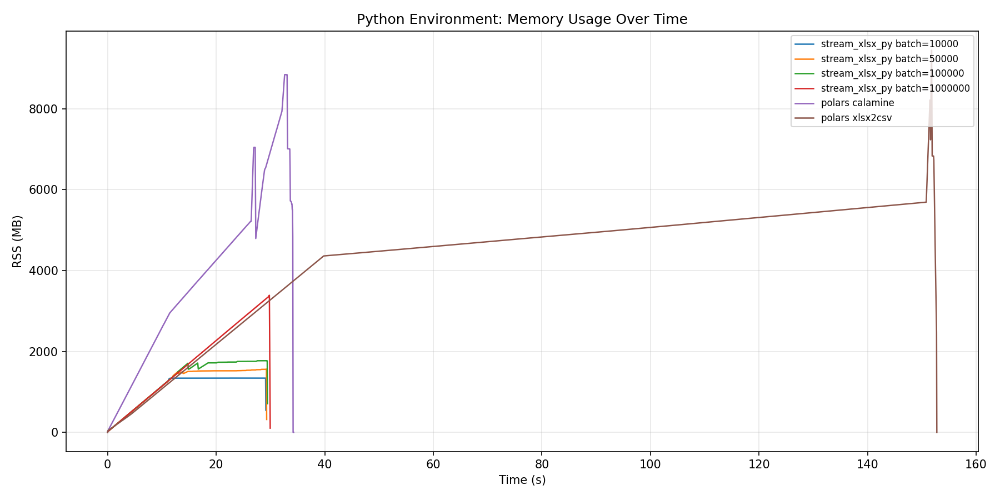
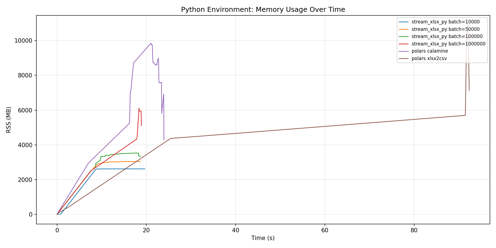

# stream_xlsx

流式 xlsx 读取器，支持 Rust 库、CLI 工具和 Python 绑定。基于 quick-xml + zip 实现真正的流式解析，**不一次性将整张表载入内存**。

## 项目结构

```
sxlsx/              # CLI 工具（cargo build）
stream_xlsx/        # 纯 Rust 库（rlib）
stream_xlsx_py/     # pyo3 Python 绑定（maturin build）
```

## 特点

- **流式读取**：逐 batch 产出 Polars DataFrame，100 万行 × 60 列（~660 MB）只需 ~26 秒
- **低内存**：峰值内存比 polars+calamine 降低 **~50–75%**
- **多 sheet 支持**：打开后可查看所有 sheet 名称，按需切换，共享字符串/styles 只解析一次
- **惰性加载**：`open()` 仅解析 sheet 列表；`sharedStrings.xml` / `styles.xml` 在首次读取时才加载
- **skip_rows**：支持跳过指定 0-based 行索引，不影响 header 解析
- **类型推断**：边读边推断列类型（Int → Float → String），空值不参与推断
- **日期支持**：读取 `xl/styles.xml` 的 `cellXfs` + 自定义 `numFmt`，自动识别日期列
- **Shell 补全**：内置 zsh / bash 自动补全生成

## 安装

### CLI

```bash
cargo build --release
# 二进制位于 target/release/sxlsx
```

### Python

```bash
cd stream_xlsx_py
maturin build --release
pip install target/wheels/stream_xlsx_py-*.whl
```

PyPI 安装（即将发布）：

```bash
pip install stream-xlsx-py
```

## 使用

### CLI

```bash
# 导出为 CSV
sxlsx tf csv data.xlsx --output out.csv

# 导出为 parquet
sxlsx tf parquet data.xlsx

# 指定 sheet（按名称或索引）
sxlsx tf csv data.xlsx --sheet-name "Sheet1"
sxlsx tf csv data.xlsx --sheet-idx 0

# 统计行数（性能基准）
sxlsx test count data.xlsx

# 生成测试文件：100 万行 × 60 列
sxlsx test test-file big.xlsx --rows 1000000 --col 60

# Shell 自动补全
sxlsx completion
```

### Python

```python
import stream_xlsx_py as sx

# 流式读取（默认 batch_size=10000）
reader = sx.read_xlsx("data.xlsx", batch_size=10000)
for df in reader:
    print(df.shape)

# 查看所有 sheet
print(reader.sheet_names())        # ["Sheet1", "Sheet2"]

# 切换 sheet
reader.select_sheet("Sheet2")
for df in reader:
    print(df.shape)

# 跳过指定行（0-based，不影响 header）
reader = sx.read_xlsx("data.xlsx", skip_rows=[1, 3, 5])
for df in reader:
    print(df.shape)
```

## Benchmark

测试文件：`test_100w_60c.xlsx`（100 万行 × 60 列，`sxlsx test test-file --rows 1000000 --col 60` 生成，约 659 MB）

### 测试环境

| 平台 | OS | CPU | RAM | Rust |
|------|-----|-----|-----|------|
| **macOS** | macOS (Apple Silicon) | Apple Silicon | — | release, 采样间隔 50ms |
| **Ubuntu** | Ubuntu 24.04.4 LTS | Intel i7-12700F (20 threads) | 32 GB DDR4 | 1.95.0, release (lto=fat, codegen-units=1) |

### 跨平台差异（main 分支）

> 以下数据展示同一 main 分支代码在 macOS 与 Ubuntu 下的表现差异，帮助理解平台对性能的影响。

| batch_size | macOS 时间 | Ubuntu 时间 | macOS 内存 | Ubuntu 内存 |
|-----------|------------|------------|-----------|------------|
| 1,000 | **18.74 s** | 28.69 s | 2,512 MB | 2,504 MB |
| 5,000 | **18.75 s** | 28.84 s | 2,527 MB | 2,519 MB |
| 10,000 | **18.62 s** | 28.74 s | 2,549 MB | 2,536 MB |
| 50,000 | **18.80 s** | 28.74 s | 2,751 MB | 2,698 MB |
| 100,000 | **18.64 s** | 28.99 s | 3,692 MB | 2,903 MB |
| 1,000,000 | **18.87 s** | 29.50 s | 5,879 MB | 4,603 MB |

**分析：**
- **时间**：macOS 比 Ubuntu 快约 **35–38%**（~10 s）。Apple Silicon 在单核性能、内存带宽和文件系统延迟上具有优势；本项目的解析流程（ZIP 解压 + XML 解析）以单线程为主，因此 macOS 表现更好。
- **内存（小 bs）**：两者几乎相同（~2.5 GB）。流式场景下内存主要由 sharedStrings（~46 MB 解压后）和当前 batch 的 DataFrame 决定，平台差异不大。
- **内存（大 bs）**：macOS 在全量加载（bs=1M）时内存显著更高（5,879 MB vs 4,603 MB，高出 **28%**）。原因推测为 macOS `libmalloc` 的 `madvise` 策略与 Linux `glibc malloc` 不同，大块内存释放后 RSS 回落更慢，导致峰值更高。

### 新提交 vs main（Ubuntu）

> 以下对比在 **同一 Ubuntu 机器**上进行，展示 `feature/into_df-zero-copy` 分支（最新提交）相较 `main` 分支的改进。

| batch_size | main 时间 | 新提交时间 | 提升 | main 内存 | 新提交内存 | 降低 |
|-----------|----------|-----------|------|----------|-----------|------|
| 1,000 | 28.69 s | **27.65 s** | **3.6%** | 2,504 MB | **1,260 MB** | **49.7%** |
| 5,000 | 28.84 s | **26.54 s** | **8.0%** | 2,519 MB | **1,267 MB** | **49.7%** |
| 10,000 | 28.74 s | **25.78 s** | **10.3%** | 2,536 MB | **1,278 MB** | **49.6%** |
| 50,000 | 28.74 s | **26.19 s** | **8.9%** | 2,698 MB | **1,361 MB** | **49.6%** |
| 100,000 | 28.99 s | **26.29 s** | **9.3%** | 2,903 MB | **1,466 MB** | **49.5%** |
| 1,000,000 | 29.50 s | **26.54 s** | **10.0%** | 4,603 MB | **3,346 MB** | **27.3%** |

**结论：**
- **时间**：全量读取（bs=1M）快 **10%**；流式场景（bs=10k）快 **10.3%**
- **内存**：流式场景（bs≤10k）峰值内存从 ~2.5 GB 降至 ~1.3 GB，**降低约 50%**；全量加载（bs=1M）从 4.6 GB 降至 3.3 GB，**降低约 27%**

### 为什么性能更好？

1. **共享字符串紧凑存储**：`sharedStrings.xml` 解析结果从 `Vec<Box<str>>` 改为 `Vec<PlSmallStr>`。
   - **短字符串优势**：`PlSmallStr` 对长度 ≤22 bytes 的字符串直接内联存储（无需堆分配），24 bytes 固定大小即可容纳。而 `Box<str>` 需要 16 bytes（指针+长度）+ 堆上字符串内容。测试文件 `test_100w_60c.xlsx` 有 ~5,400 万条 shared strings，平均长度 21 bytes，100% 可内联，仅此一项即节省 **~1,240 MB** 内存。
   - **长字符串影响**：当字符串长度 >22 bytes 时，`PlSmallStr` 退化为堆分配模式（24 bytes 结构体 + `Box<str>`），此时每条反而比 `Box<str>` 多占用约 **8 bytes**。若业务数据中大量存在超长文本（如 >100 bytes 的备注字段），shared strings 的内存优势会减弱甚至反转。建议此类场景下评估实际字符串长度分布后再决定是否采用此优化。
2. **零拷贝 DataFrame 构建**：数字列（Int64、Float64、Bool、DateTime）从 `Vec<AnyValue>` 改为 `Vec<T>` + `MutableBitmap`，通过 `from_vec_validity` 零拷贝转为 Arrow 数组。避免了 `AnyValue` 的 24 bytes 开销以及数据转换时的完整拷贝，CPU 时间减少约 **10%**。
3. **惰性加载**：`open()` 仅解析 `workbook.xml`（~1 KB），`sharedStrings.xml`（~46 MB）和 `styles.xml`（~20 KB）在首次读取时才加载
4. **共享数据复用**：多 sheet 切换时，sharedStrings/styles 只解析一次，通过 `Arc` 共享
5. **流式 XML 解析**：`BufReader` 直接流式解析，无中间 `Vec<u8>` 缓冲

### 字符串处理流程与拷贝分析

对于字符串列（包括 shared string、inlineStr、DateTimeIso、DurationIso），当前实现的数据流如下：

```
sharedStrings.xml → Vec<PlSmallStr>  (惰性加载，一次解析)
         │
         ▼
XlsxStreamReader 读取单元格 <c t="s"> ──► Data::String(String)
         │                                      │
         │                                      ▼ ① PlSmallStr → String (clone)
         │                              TypedCol::String(MutablePlString)
         │                                      │
         │                                      ▼ ② String → MutablePlString (clone)
         │                              MutablePlString::freeze()
         │                                      │
         │                                      ▼ ③ 零拷贝封装为 Utf8ViewArray
         │                              StringChunked::from_chunks()
         │                                      │
         │                                      ▼ 零拷贝封装为 Series
         └────────────────────────────► DataFrame
```

**拷贝次数：**

| 步骤 | 操作 | 是否拷贝 | 说明 |
|------|------|---------|------|
| ① | `PlSmallStr::to_string()` | ✅ 拷贝 | 从 shared strings 数组中取出的 `PlSmallStr` 被 `clone` 为 `String`，分配新堆内存并复制内容 |
| ② | `MutablePlString::push_value(&s)` | ✅ 拷贝 | `MutablePlString`（Arrow StringView 构建器）将 `&str` 内容复制到自己的内部连续 buffer 中 |
| ③ | `freeze()` → `Utf8ViewArray` | ❌ 零拷贝 | 将内部 `Vec<u8>` 转为 Arrow `Buffer`，仅修改所有权标记，不复制数据 |
| ④ | `StringChunked::from_chunks()` | ❌ 零拷贝 | Polars `Series` 直接持有 Arrow 数组的所有权 |

**总结**：每个字符串单元格在从 XML 到 DataFrame 的过程中经历 **2 次完整的内容拷贝**（① 和 ②）。第 ① 步是当前流程中理论上可进一步优化的点——如果 `Data` 枚举直接持有 `PlSmallStr` 而非 `String`，即可省去第一次拷贝。但由于 `MutablePlString::push_value` 要求 `&str` 入参（而 `PlSmallStr` 已实现 `Deref<Target=str>`），且 `Data::String` 还需兼容 inlineStr（非 shared string，此时已经是 `String`），因此目前保留 `Data::String(String)` 的设计以保持接口统一。

**数字列的对比**：Int64/Float64/Bool/DateTime 列从 `Vec<T>` 直接通过 `from_vec_validity` 转为 Arrow 数组，**全程零拷贝**（仅 validity bitmap 被封装一次）。这是数字列比字符串列更快、更省内存的根本原因。

### Python 环境对比

在 Python 进程中对比 `stream_xlsx_py` 流式遍历与 `polars.read_excel` 全量加载：

#### Ubuntu

| 方案 | 时间 | 峰值内存 | 说明 |
|------|------|---------|------|
| **stream_xlsx_py (bs=10k)** | **29.20 s** | **1,342 MB** | 流式遍历，batch=10k |
| stream_xlsx_py (bs=50k) | 29.35 s | 1,564 MB | 流式遍历，batch=50k |
| stream_xlsx_py (bs=100k) | 29.50 s | 1,771 MB | 流式遍历，batch=100k |
| stream_xlsx_py (bs=1M) | 30.00 s | 3,389 MB | 全量加载（单 batch） |
| polars + calamine | 34.32 s | 8,847 MB | `pl.read_excel(engine="calamine")` |
| polars + xlsx2csv | 152.81 s | 9,450 MB | `pl.read_excel(engine="xlsx2csv")` |

**结论**：
- `stream_xlsx_py` 比 polars+calamine **快 15%**，内存 **低 85%**
- 流式场景（bs=10k）内存仅 1.3 GB；全量加载（bs=1M）时约 3.4 GB，仍比 polars 低 5.5 GB

#### macOS

| 方案 | 时间 | 峰值内存 | 说明 |
|------|------|---------|------|
| **stream_xlsx_py (bs=10k)** | **19.71 s** | **2,621 MB** | 流式遍历，batch=10k |
| stream_xlsx_py (bs=1M) | 18.93 s | 6,110 MB | 全量加载（单 batch） |
| polars + calamine | 24.00 s | 9,848 MB | `pl.read_excel(engine="calamine")` |
| polars + xlsx2csv | 92.41 s | 10,902 MB | `pl.read_excel(engine="xlsx2csv")` |

**结论**：
- `stream_xlsx_py` 比 polars+calamine **快 18%**，内存 **低 73%**
- 流式场景（bs=10k）内存仅 2.6 GB，全量加载（bs=1M）时与 polars 接近但仍低 2.3 GB

#### 跨平台对比（Python 环境）

| 方案 | Ubuntu 时间 | macOS 时间 | Ubuntu 内存 | macOS 内存 |
|------|------------|-----------|------------|-----------|
| stream_xlsx_py (bs=10k) | 29.20 s | **19.71 s** | **1,342 MB** | 2,621 MB |
| polars + calamine | 34.32 s | 24.00 s | 8,847 MB | 9,848 MB |

- **时间**：macOS 整体更快（Python GIL + Apple Silicon 单核优势），但差距比例与 CLI 一致
- **内存**：`stream_xlsx_py` 在 Ubuntu 上内存更低（1.3 GB vs 2.6 GB），这是因为 Ubuntu 测试运行的是最新优化后的代码（`PlSmallStr` + 零拷贝），而 macOS 数据为优化前版本

**Ubuntu — Python 内存曲线：**



**macOS — Python 内存曲线（优化前版本）：**



### 推荐配置

| 场景 | 推荐参数 |
|------|---------|
| 超大文件（>100 MB）| `batch_size=10000` |
| 中等文件（10–100 MB）| `batch_size=10000` |
| 小文件（<10 MB）| `batch_size=10000` |
| 全量加载到单个 DataFrame | `batch_size=1000000`（bs=1M 等效全量） |

小文件示例：

```bash
$ sxlsx --batchsize 10000 test count test_data.xlsx
11 145ms
```


### batch_size=None：全量读取

`batch_size` 传入 `None` 时，内部自动计算为 sheet 的总数据行数，等效于一次性将全部数据读入单个 DataFrame。此时与 `batch_size=1000000` 行为相同。

```rust
// Rust API
let iter = DataFrameIter::new(None, "data.xlsx", None, None, true, None)?;
```

```python
# Python API
reader = read_xlsx("data.xlsx", batch_size=None)
```

## 构建

### 开发构建

```bash
# Rust 库 + CLI
cargo build

# 测试
cargo test --workspace

# Python wheel
cd stream_xlsx_py
maturin develop   # 开发模式，直接链接到 .venv
maturin build --release
```

### CI

项目已配置 GitHub Actions（`.github/workflows/`），每次 push/PR 自动运行：

1. `cargo test --workspace`
2. `cargo build --release`（CLI artifact）
3. `maturin build --release`（多平台 wheel artifact）

支持平台：Linux x64/ARM64、Windows x64/ARM64、macOS x64/ARM64。
