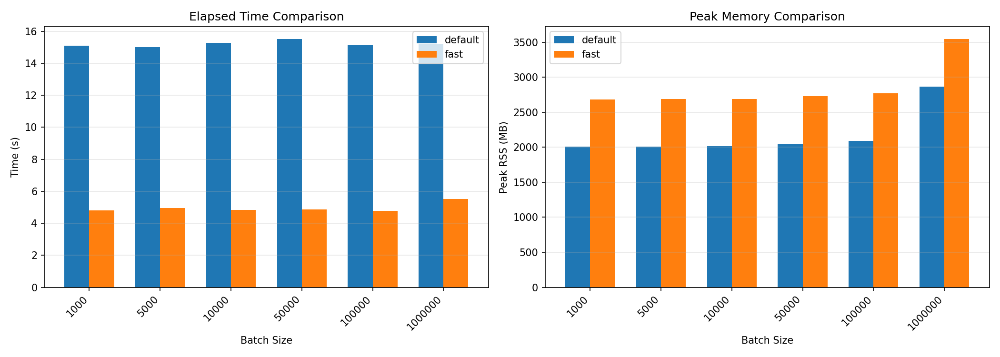
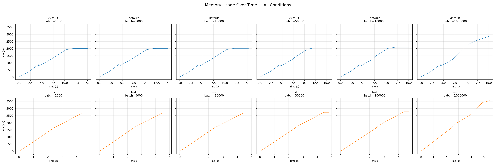
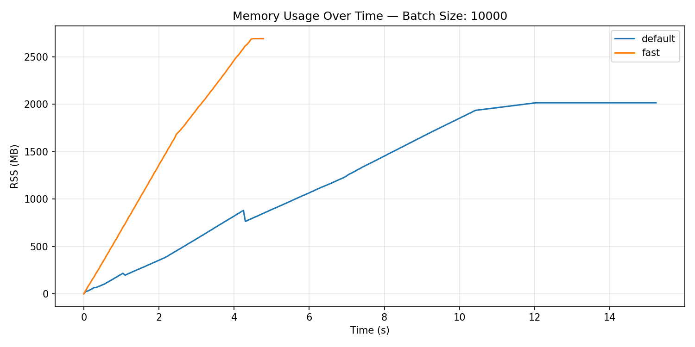
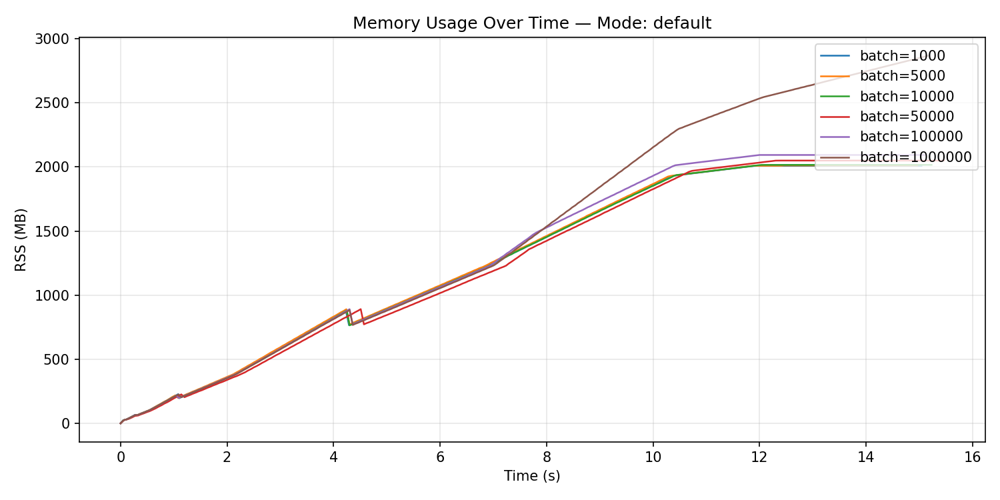
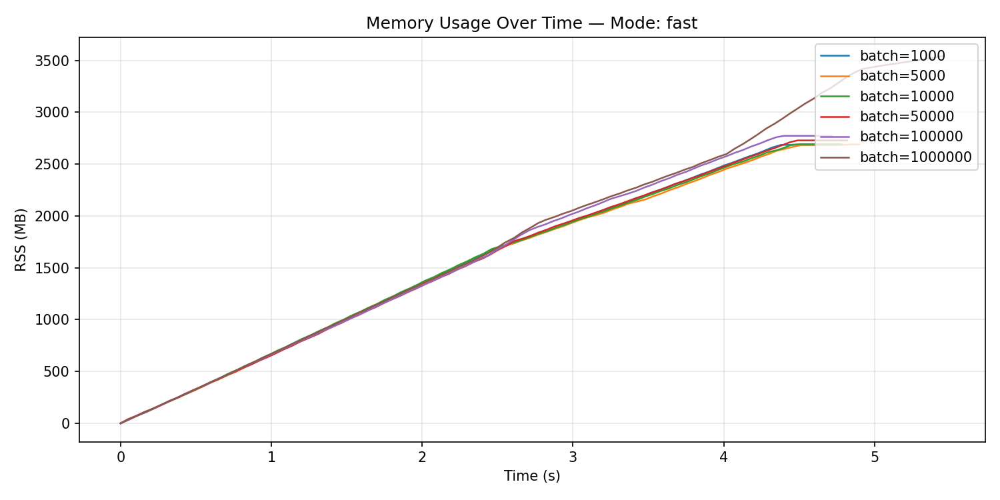
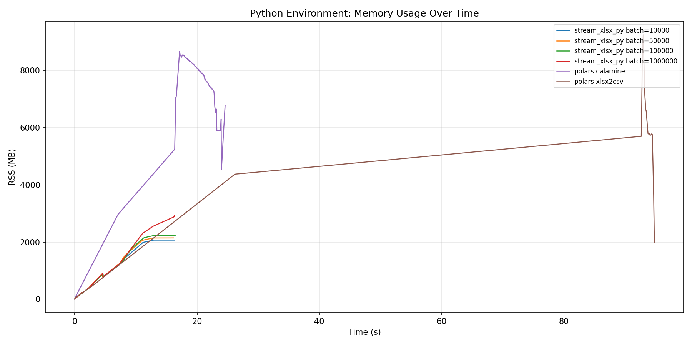

# stream_xlsx

流式 xlsx 读取器,支持 Rust 库、CLI 工具和 Python 绑定。基于 quick-xml + zlib-rs 实现真正的流式解析,**不一次性将整张表载入内存**。

## 特点

- **两种解析模式**:
  - **default 模式** — 单线程流式,内存最低(~2 GB,适合超大数据集)
  - **fast 模式** (`--fast`) — 8 worker 并发解析,速度 **~3x** faster(~4.8s vs ~15s)
- **流式产出**:逐 batch 产出 Polars DataFrame,100 万行 × 60 列(~660 MB)默认模式 ~15s,fast 模式 ~4.8s
- **多 sheet 支持**:打开后可查看所有 sheet 名称,按需切换,sharedStrings/styles 只解析一次
- **惰性加载**:`open()` 仅解析 sheet 列表;`sharedStrings.xml` / `styles.xml` 在首次读取时才加载
- **类型推断**:边读边推断列类型(Int → Float → String),空值不参与推断
- **skip_rows**:支持跳过指定 0-based 行索引,不影响 header 解析
- **日期支持**:读取 `xl/styles.xml` 的 `cellXfs` + 自定义 `numFmt`,自动识别日期列
- **Shell 补全**:内置 zsh / bash 自动补全生成

## 项目结构

```
sxlsx/              # CLI 工具(cargo build)
stream_xlsx/        # 纯 Rust 库(rlib)
stream_xlsx_py/     # pyo3 Python 绑定(maturin build)
```

## 安装

### CLI

```bash
cargo build --release
# 二进制位于 target/release/sxlsx
```

### Python

```bash
cd stream_xlsx_py
maturin build --release
pip install target/wheels/stream_xlsx_py-*.whl
```

## 使用

### CLI

```bash
# 导出为 CSV(default 模式)
sxlsx tf csv data.xlsx --output out.csv

# 导出为 parquet,启用 fast 并发模式
sxlsx tf csv data.xlsx --fast --output out.csv

# 指定 sheet(按名称或索引)
sxlsx tf csv data.xlsx --sheet-name "Sheet1"
sxlsx tf csv data.xlsx --sheet-idx 0

# 统计行数(性能基准)
sxlsx test count data.xlsx
sxlsx test count data.xlsx --fast

# 生成测试文件:100 万行 × 60 列
sxlsx test test-file big.xlsx --rows 1000000 --col 60

# Shell 自动补全
sxlsx completion
```

#### fast 模式调优参数

`--fast` 启用并发解析,以下参数可微调(都有合理默认值,通常无需修改):

```bash
sxlsx tf csv data.xlsx --fast \
  --fast-parallelism 8 \     # worker 线程数
  --fast-chunk-size 1000 \   # 每 chunk cell 数
  --fast-queue-cap 1 \       # 队列容量倍数(queue = threads × mul + 1)
  --fast-temp-kb 1024 \      # 解压临时缓冲区(KB)
  --fast-buf-kb 1024         # ZIP 读取 BufReader 大小(KB)
```

### Python

```python
import stream_xlsx_py as sx

# 流式读取(默认 batch_size=10000)
reader = sx.read_xlsx("data.xlsx", batch_size=10000)
for df in reader:
    print(df.shape)

# 查看所有 sheet
print(reader.sheet_names())        # ["Sheet1", "Sheet2"]

# 切换 sheet
reader.select_sheet("Sheet2")
for df in reader:
    print(df.shape)

# 跳过指定行(0-based,不影响 header)
reader = sx.read_xlsx("data.xlsx", skip_rows=[1, 3, 5])
for df in reader:
    print(df.shape)
```

## Benchmark

**测试文件**:`test_100w_60c.xlsx`(100 万行 × 60 列,通过 `sxlsx test test-file --rows 1000000 --col 60` 生成,约 659 MB,59,500,954 个 cell)

**测试环境**:macOS (Apple Silicon),Rust release(`opt-level=3`, `lto=fat`, `codegen-units=1`)

### default 模式 vs fast 模式



| batch_size | default 时间 | fast 时间 | 加速 | default 内存 | fast 内存 |
|-----------|-------------|----------|------|-------------|----------|
| 1,000     | 15.10 s     | **4.82 s** | **3.1x** | 2,009 MB    | 2,685 MB |
| 5,000     | 15.02 s     | **4.95 s** | **3.0x** | 2,012 MB    | 2,689 MB |
| 10,000    | 15.28 s     | **4.84 s** | **3.2x** | 2,016 MB    | 2,692 MB |
| 50,000    | 15.51 s     | **4.87 s** | **3.2x** | 2,050 MB    | 2,728 MB |
| 100,000   | 15.15 s     | **4.77 s** | **3.2x** | 2,093 MB    | 2,772 MB |
| 1,000,000 | 15.22 s     | **5.53 s** | **2.8x** | 2,867 MB    | 3,545 MB |

**关键观察**:
- **时间**:fast 模式在所有 batch_size 下都 ~3x faster,且**对 batch_size 不敏感**——不像 default 模式那样需要挑 batch_size
- **内存**:fast 模式多消耗 ~30% 内存(并发 worker 的中间 buffer 和 channel queue),换来 3x 速度

### 内存曲线



各 batch_size 下的 RSS 时间曲线,可以看到 default 和 fast 模式的内存稳定在一个平台上,没有持续增长——流式特性的体现。

具体某 batch_size(`bs=10000` 为推荐配置):



分模式查看:

| default | fast |
|---------|------|
|  |  |

### Python 环境对比

在 Python 进程中对比 `stream_xlsx_py` 与 `polars.read_excel`:

| 方案 | 时间 | 峰值内存 | 备注 |
|------|------|---------|------|
| **stream_xlsx_py (bs=10000)** | **16.37 s** | **2,068 MB** | 流式,推荐配置 |
| stream_xlsx_py (bs=50000) | 16.22 s | 2,143 MB | 流式 |
| stream_xlsx_py (bs=100000) | 16.48 s | 2,237 MB | 流式 |
| stream_xlsx_py (bs=1000000) | 16.35 s | 2,919 MB | 全量加载 |
| polars + calamine | 24.66 s | 8,672 MB | `pl.read_excel(engine="calamine")` |
| polars + xlsx2csv | 95.00 s | 9,249 MB | `pl.read_excel(engine="xlsx2csv")` |

**结论**:
- `stream_xlsx_py` 比 `polars+calamine` **快 1.5x**,内存 **低 76%**
- 比 `polars+xlsx2csv` **快 5.8x**,内存 **低 78%**
- 内存曲线(注意 polars 峰值 8-9 GB vs stream_xlsx_py 稳定 2 GB):



### 推荐配置

| 场景 | 推荐 | 理由 |
|------|------|------|
| 超大文件(>100 MB)、内存敏感 | default + `batch_size=10000` | 内存最低(~2 GB),无并发开销 |
| 通用大文件、追求速度 | `fast` + `batch_size=10000` | ~3x faster,内存多 30% |
| 全量加载到单个 DataFrame | `fast` + `batch_size=1000000` | 一次产出,无 batch 调度 |
| Python 通用 | `stream_xlsx_py` 默认参数 | 已经过调优,无需额外配置 |

## 工作原理

### 流式解析管线(default 模式)

```
ZIP file (deflate)
   │  后台线程逐 chunk 解压
   ▼
mpsc channel (256 KB chunks)
   │
   ▼
quick-xml 事件循环
   │  边解析边产出 Cell<Data>
   ▼
TypedCols (按类型 zero-copy 存储)
   │
   ▼ ① Int64/Float64/Bool/DateTime: from_vec_validity
   ▼ ② String: PlSmallStr → MutablePlString → StringView(零拷贝封装)
   Polars DataFrame
```

### fast 模式:并发解析

fast 模式在 default 模式基础上,加上 8 worker 线程并发解析单元格:

```
ZIP file
   │  后台解压线程
   ▼
单线程 scanner (split boundaries + memchr)
   │  按 CHUNK_SIZE (默认 1000 cells) 切分
   ▼
crossbeam channel
   │  queue capacity = parallelism × 1 + 1 (天然背压)
   ▼
┌──────────┬──────────┬───── ┬──────────┐
│ worker 1 │ worker 2 │ ... │ worker 8 │
└──────────┴──────────┴───── ┴──────────┘
   │  并发解析各 cell 字节
   ▼
result channel
   │
   ▼
main thread (按 seq 顺序重组 + 输出 DataFrame)
```

关键技术点:
- **scanner 与解压并行**:scanner 单线程扫 XML 边界,worker 解析纯 CPU 任务
- **CHUNK_SIZE=1000**:每个 chunk 包含 1000 cells,在 channel 往返开销和 worker 利用率之间取得平衡
- **天然背压**:queue 容量 = parallelism + 1,worker 满载时 scanner 自动阻塞

### 零拷贝 DataFrame 构建

数字列(Int64 / Float64 / Bool / DateTime):
- 边读边存入 `Vec<T> + MutableBitmap`
- 通过 `from_vec_validity` 零拷贝转为 Arrow 数组
- 避免 `AnyValue` 24 字节/值的开销

字符串列(SharedString / InlineString / DateTimeIso / DurationIso):
- `PlSmallStr` 内部存储:长度 ≤22 字节直接 inline,无需堆分配
- `MutablePlString::push_value` + `freeze()` 封装为 `Utf8ViewArray`,**只标记所有权,不复制**
- `DataFrame::from_chunks` 零拷贝持有 Arrow 数组

## 构建

### 开发构建

```bash
# Rust 库 + CLI
cargo build

# 测试
cargo test --workspace

# Python wheel
cd stream_xlsx_py
maturin develop   # 开发模式,直接链接到 .venv
maturin build --release
```

### CI

项目已配置 GitHub Actions(`.github/workflows/`),每次 push/PR 自动运行:

1. `cargo test --workspace`
2. `cargo build --release`(CLI artifact)
3. `maturin build --release`(多平台 wheel artifact)

支持平台:Linux x64/ARM64、Windows x64/ARM64、macOS x64/ARM64。
